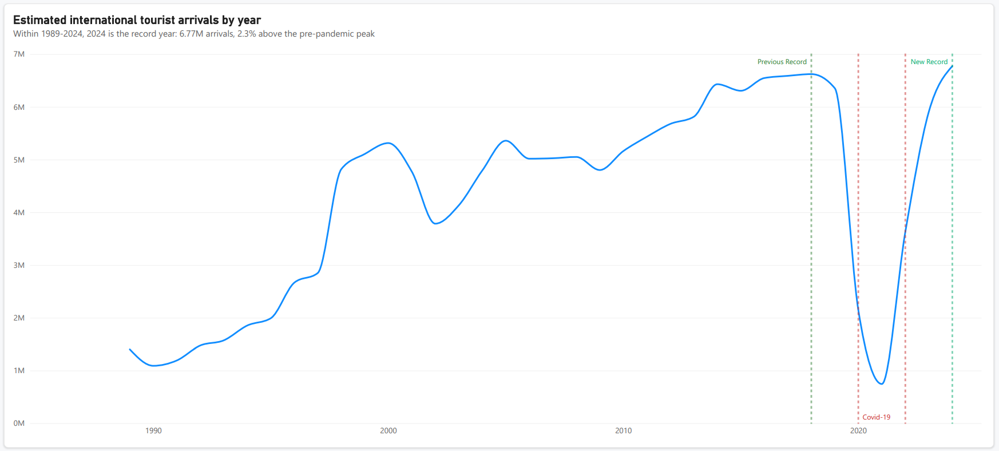

# Brazilian Tourism Data Pipeline (1989–2024)

An end-to-end data project built from 36 annual datasets of international tourism arrivals in Brazil, covering the workflow from initial data exploration and historical ETL to Power BI analysis.

The project began with a single-year dataset and evolved into a reproducible pipeline capable of processing the complete historical series from 1989 to 2024.

## The analysis

The historical series reveals how international tourism to Brazil changed over more than three decades, including periods of growth, structural changes and the sharp disruption caused by the COVID-19 pandemic.



The chart above represents the starting point of the analysis: understanding how the volume of international tourist arrivals evolved throughout the historical series.

The complete interactive analysis is available in the Power BI report.

**[View the complete Power BI analysis (PDF)](powerbi/tourism-analysis.pdf)** <br>
**[Open the Power BI report (PBIX)](powerbi/tourism-analysis.pbix)**

---

## How this project came together

This project started as a simple exploration of a single tourism dataset. After understanding its structure and identifying some of its characteristics, I expanded the project to the complete historical series.

The project is organized into three phases:

* **Phase 1 — Exploration:** understanding the structure and characteristics of the 1989 dataset.
* **Phase 2 — ETL Pipeline:** processing and consolidating the historical data from 1989 to 2024.
* **Phase 3 — Power BI Analysis:** using the consolidated dataset to explore long-term tourism trends and patterns.

---

## Phase 1 — Exploration (1989)

The project began with the exploration of the 1989 dataset in `notebooks/Exploration_1989.ipynb`.

The original file contained approximately **17,000 records across 12 columns**. During the initial exploration, I identified characteristics that would later influence the data processing pipeline:

* The dataset used **Latin-1 encoding**.
* The `Chegadas` column contained **588 missing values**.
* Different variables represented aspects such as country of origin, Brazilian state, point of entry, transportation mode and month.
* Argentina was the main country of origin in the dataset.
* Land transportation was particularly relevant for neighboring countries.
* The South region played an important role as a gateway for international arrivals.
* Arrivals showed noticeable seasonality, especially around January and February.

This first analysis was important not only for generating initial insights, but also for understanding the variations and inconsistencies that would need to be considered when processing the complete historical series.

---

## Phase 2 — ETL Pipeline (1989–2024)

After exploring the 1989 data, the project was expanded to process the complete historical series in `notebooks/tourism_1989_2024.ipynb`.

The pipeline processes **36 annual files**, dealing with differences that appeared between years instead of assuming that every file followed exactly the same structure.

The main steps include:

* Reading the original CSV files with the appropriate encoding.
* Standardizing column names and data types.
* Handling schema changes between different years.
* Identifying and dealing with missing data.
* Addressing semantic inconsistencies across the historical files.
* Adding year information to preserve data lineage.
* Consolidating the datasets into a single analysis-ready table.
* Generating different output formats for different use cases.

The resulting dataset contains approximately **953,000 records across 8 columns**, covering the period from 1989 to 2024.

The ETL notebook intentionally contains no charts. Once the historical data was consolidated and cleaned, the project moved into Power BI for the analysis and visualization stage.

### Output layers

The pipeline generates several outputs from the consolidated data:

* **Parquet:** partitioned by year for efficient analytical processing.
* **SQLite:** stored locally as `tourism_dw.db`, with `fact_tourism_arrivals` as the main fact table.
* **CSV:** compressed version of the processed dataset.
* **CSV for Power BI:** a plain CSV version used as the source for the dashboard.

The different formats provide alternatives depending on the analytical workflow and demonstrate how the same processed dataset can be made available for different use cases.

---

## Phase 3 — Power BI Analysis

With the historical data consolidated, the project moved from data preparation to analysis in Power BI.

The report uses the complete **1989–2024 historical series** to investigate how international tourism to Brazil changed over time.

The analysis explores questions such as:

* How did international tourist arrivals evolve over the 36-year period?
* Which countries and regions were the main sources of visitors?
* How did the importance of different points of entry change?
* What role did each transportation mode play over time?
* Which seasonal patterns can be observed in the historical data?
* How did the COVID-19 pandemic affect international tourism?
* Did patterns observed in the initial 1989 exploration remain consistent over the following decades?

Rather than limiting the project to data preparation, the Power BI stage uses the consolidated dataset to transform the historical records into an interactive analytical view.

The complete report is available in `powerbi/`.

A PDF export is also included for quick inspection without requiring Power BI Desktop.

---

## Project structure

```text
├── data/
│   ├── raw/
│   └── processed/
├── notebooks/
│   ├── Exploration_1989.ipynb
│   └── tourism_1989_2024.ipynb
├── powerbi/
│   ├── tourism-arrivals-over-time.png
│   ├── tourism-analysis.pbix
│   └── tourism-analysis.pdf
├── .gitignore
├── .python-version
├── README.md
├── pyproject.toml
└── uv.lock
```

The raw datasets and generated processed files are **not included in the repository**. They are generated locally when running the pipeline and are excluded from version control.

---

## Data source

The data comes from the Brazilian Ministry of Tourism's open data portal:

**Ministério do Turismo — Dados Abertos**

The original datasets cover international tourism arrivals in Brazil across different years and contain information related to origin, destination, entry point, transportation mode and time period.

---

## How to run

### Requirements

* Python 3.12
* [uv](https://docs.astral.sh/uv/)
* Power BI Desktop for opening and interacting with the `.pbix` report

### 1. Clone the repository

```bash
git clone https://github.com/Dev-Yudii/tourism-analysis.git
cd tourism-analysis
```

### 2. Install the environment

```bash
uv sync
```

### 3. Download the raw datasets

Download the annual CSV files from the Ministry of Tourism's open data portal and place them in:

```text
data/raw/
```

The files should contain the datasets covering the period from **1989 to 2024**.

### 4. Run the notebooks

The notebooks should be followed in order:

```text
notebooks/Exploration_1989.ipynb
        ↓
notebooks/tourism_1989_2024.ipynb
        ↓
powerbi/
```

The first notebook explores the original 1989 dataset.

The second processes the complete historical series and generates the analysis-ready outputs.

The resulting dataset can then be loaded into Power BI to reproduce the analytical stage of the project.

---

## Project status

The project is currently **complete**, covering the full workflow from initial data exploration to historical data processing and BI analysis:

**Exploration → ETL → Analysis**

This version represents the current scope of the project and is considered finished for now. I may return to it in the future if I want to experiment with a new tool, technique or analytical approach.
